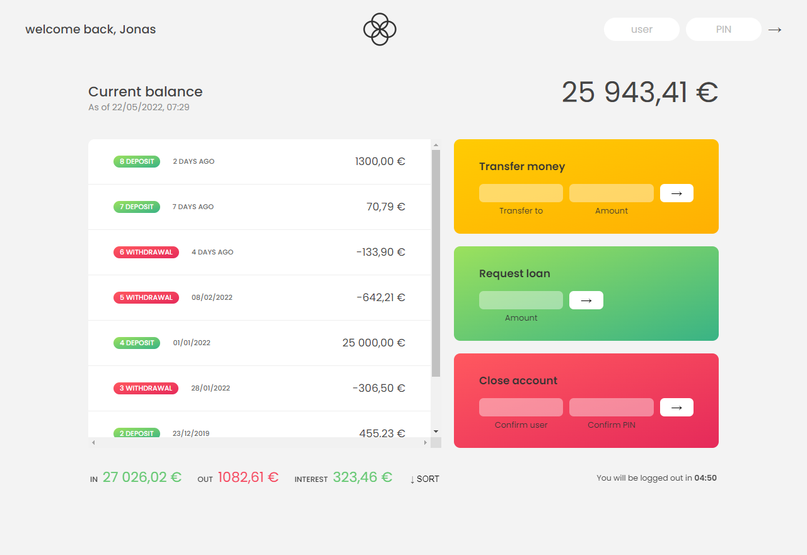

<h1 align="center"> Banksit </h1>

<h3> A simple bank application made with JavaScript for learning purposes and for practicing on (Arrays, Numbers, Dates, Timers.) in JS. </h3>

The project is a simulation for a bank application so it has pre-created accounts that you can use the functionalities of the app with them.

**you can fake login with one of these two accounts**

user `js` and PIN `1111`

user `jd` and PIN `2222`

## The functionalities in the app 

- login with username and password 
- logout timer 
- display the user movements 
- display the current balance
- display a summery of the movements 

Bank transactions
- transfer money between the accounts 
- requeat a loan from the bank 
- delete your account 

### DEMO 

# [Live Demo](https://abdelrhman-ahmed-kamal.github.io/banksit/) 

